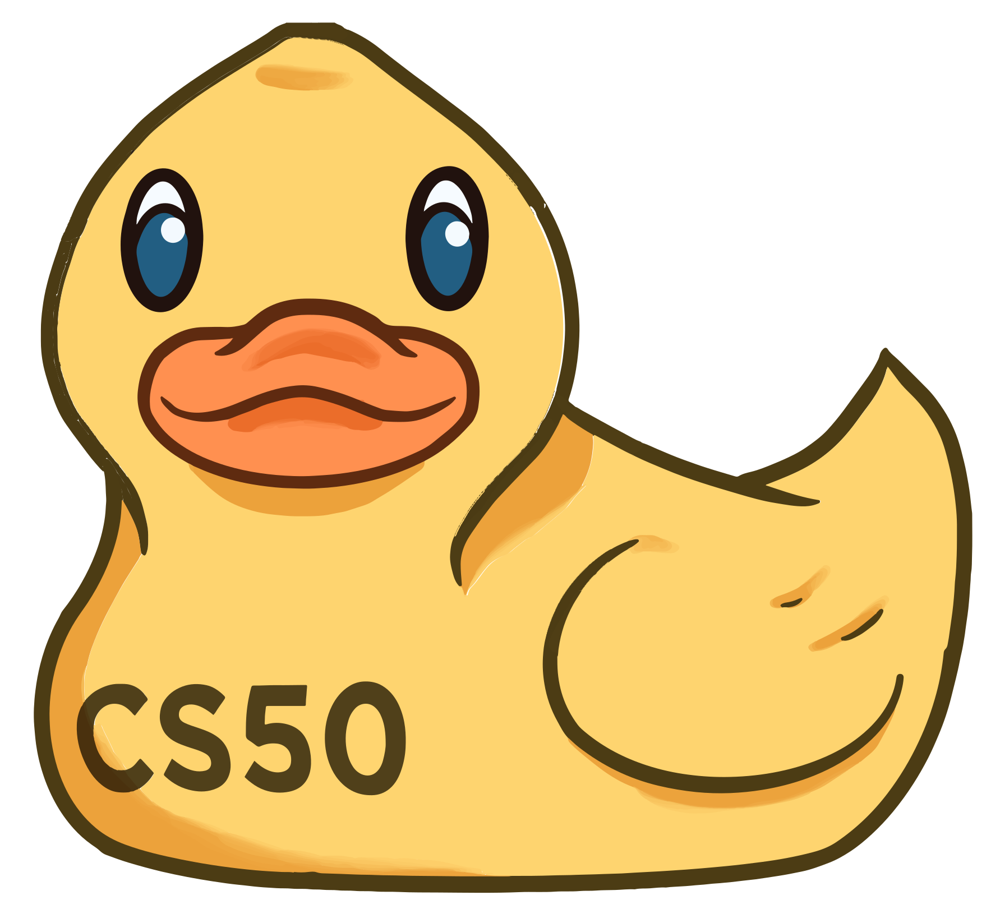

   <a href="https://patyfil.github.io/cs50-cc50-harvard/">Voltar ao README</a>

# Semana 1's (Módulo 1 - C)  

###  [BAIXAR OS ARQUIVOS DESSA AULA](./assets/ArquivosZips/semana1/src1.zip)  
###  [BAIXAR O SLIDE DESSA AULA](./assets/slides/1-C.pdf)  

# Videoaulas - C  

OBS: Habilitar legendas

##  [Videoaula 1 - C](https://www.youtube.com/watch?v=rCTePooJP_s&t=283s) (Link da Fundação Estudar na Prática)  

##  [Videoaula 1 - CS50 2021 in HDR - Lecture 1 – C](https://www.youtube.com/watch?v=URrzmoIyqLw&t=1s) (Link da Harvard)  

##  [Videoaula 1 - CS50 2022 - Lecture 1 - C](https://www.youtube.com/watch?v=U29J1tXcPqo&t=5s) (Link da Harvard)  

##  [Videoaula 2 - Data Types - CS50 Shorts](hhttps://www.youtube.com/watch?v=Fc9htmvVZ9U)  

##  [Videoaula 3 - Operators - CS50 Shorts](https://youtu.be/f1xZf4iJDWE)  

##  [Videoaula 4 - Conditional Statements - CS50 Shorts](https://www.youtube.com/watch?v=1wsaV5nVC7g)  

##  [Videoaula 5 - Loops - CS50 Shorts](https://www.youtube.com/watch?v=WgX8e_O7eG8)  

##  [Videoaula 6 - Command Line - CS50 Shorts](https://www.youtube.com/watch?v=BnJ013X02b8)  

##  [Videoaula 7 - Magic Numbers - CS50 Shorts](https://www.youtube.com/watch?v=vK_naJkrtjc)  

 

# Exercícios - C  

## Abra a IDE de sua preferência: (irei usar o VsCode)

 &nbsp;IDE Online  ou

 &nbsp;(Abre o VsCode no Computador ou o VsCode Online pela aba do navegador)  

### Descritivo dos Exercícios: 
##  [PORT - Exercício 0: Hello](https://patyfil.github.io/cs50-cc50-harvard/semana1/hello)  
[ING - pset1 exercise 0](https://cs50.harvard.edu/x/2023/psets/1/hello/)  

##  [PORT - Exercício 1: Mario versão fácil](https://patyfil.github.io/cs50-cc50-harvard/semana1/mario-less)  
[ING - pset1 exercise 1](https://cs50.harvard.edu/x/2023/psets/1/mario/less/)   

##  [PORT - Exercício 2: Mario versão difícil](https://patyfil.github.io/cs50-cc50-harvard/semana1/mario-more)  
[ING - pset1 exercise 2](https://cs50.harvard.edu/x/2023/psets/1/mario/more/)  

##  [PORT - Exercício 3: Dinheiro](https://patyfil.github.io/cs50-cc50-harvard/semana1/cash)  
[ING - pset1 exercise 3](https://cs50.harvard.edu/x/2023/psets/1/cash/)  

##  [PORT - Exercício 4: Crédito](https://patyfil.github.io/cs50-cc50-harvard/semana1/credit)  
[ING - pset1 exercise 4](https://cs50.harvard.edu/x/2023/psets/1/credit/)  

##  [PORT - Laboratório 1: Crescimento Populacional](https://patyfil.github.io/cs50-cc50-harvard/semana1/lab1-population)  

&nbsp;

# [Problemas práticos da semana 1](https://cs50.harvard.edu/x/2023/problems/1/):  

* Esses problemas assumem que você já configurou seu Codespace CS50 no Laboratório 1 . Certifique-se de concluir isso antes de tentar esses problemas.

Além do laboratório e do conjunto de problemas desta semana, você pode tentar qualquer um destes (opcional!) problemas práticos:

* [Debug](https://cs50.harvard.edu/x/2023/problems/1/debug/), para se familiarizar com a sintaxe C e programas de depuração  
* [Half (Metade)](https://cs50.harvard.edu/x/2023/problems/1/half/), para praticar a criação de uma função  
* [Prime](https://cs50.harvard.edu/x/2023/problems/1/prime/), para praticar usando `for` loops  

&nbsp;

   <a href="https://patyfil.github.io/cs50-cc50-harvard/">Voltar ao README</a>

