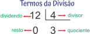
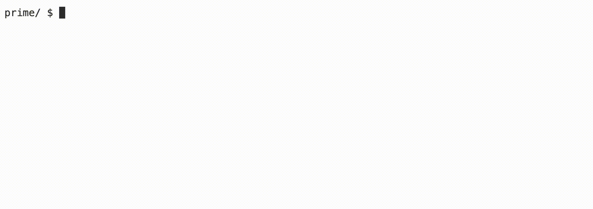

<p align="right">
   <a href="https://patyfil.github.io/cs50-cc50-harvard/">Voltar ao README</a>
</p>
<p align="right">
   <a href="https://patyfil.github.io/cs50-cc50-harvard/1-C.html">Voltar ao Índice da Semana 1</a>
</p>

# [Prime (Primo)](https://cs50.harvard.edu/x/2023/problems/1/prime/)  


# Metas de aprendizagem
* Pratique usando `for` loops  
* Usando módulo  
* Criando uma função booleana  


# Fundo
[Números primos](https://pt.wikipedia.org/wiki/N%C3%BAmero_primo) são definidos como números inteiros maiores que 1, cujos únicos divisores são 1 e ele mesmo. Portanto, 3 é primo porque seus únicos divisores são 1 e 3, enquanto 4 é composto e não primo, porque é o produto de 2 × 2. Neste laboratório, você escreverá um algoritmo para gerar todos os números primos em um intervalo especificado pelo usuário.

## dicas
* O módulo (`%`) pode ser útil, pois produz o resto ao dividir dois números inteiros.
* Por definição, 1 não é um número primo, pois ele não tem dois divisores. Somente é divisível por ele mesmo.
* Existe apenas um número primo par, 2. Como "dois" é o único número primo par, o termo "primo ímpar" refere-se a todo primo maior do que dois.
* Os números divisíveis por vários números são chamados compostos.  

<p align="center">

</p>

# Demonstração




# Começando
1 - Faça login em `code.cs50.io` usando sua conta do GitHub.  
2 - Clique dentro da janela do terminal e execute cd.  
3 - No `$`prompt, digite `mkdir prime`  
4 - Agora execute `cd prime`  
5 - Em seguida, copie e cole `wget https://cdn.cs50.net/2022/fall/labs/1/prime.c` em seu terminal para baixar o código de distribuição deste laboratório.  
6 - Você deve completar a função booleana, `prime`, que testa se um número é primo e retorna true se for, e false se não for.  

# Detalhes da Implementação
A maneira mais fácil de verificar se um número é primo é tentar dividi-lo por todos os números de 2 até, mas não incluindo, o próprio número. Se qualquer número se divide sem deixar resto, esse número não é primo.

A função `main` no código de distribuição contém um `for` loop que percorre o intervalo especificado pelo usuário, com ambas as extremidades incluídas. Por exemplo, se o usuário digitar `1` for `min` e `100` for `max`, o forloop testará cada número, de 1 a 100. Cada um desses números é passado para uma função, `prime`, que você implementará para retornar ou `true` ou `false` dependendo se o número for primo.

# Pergunta para reflexão
* Você pode tornar o algoritmo de localização de primos mais eficiente do que verificar se um número é divisível por todo número entre 2 e 1 menor que ele mesmo? Você consegue pensar em outra maneira de gerar números primos?

# Como testar seu código
Seu programa deve se comportar de acordo com os exemplos abaixo.

```
prime/ $ ./prime

Minimum: 1
Maximum: 100
2
3
5
7
11
13
17
19
23
29
31
37
41
43
47
53
59
61
67
71
73
79
83
89
97
```

Você pode verificar seu código usando `check50`, um programa que o CS50 usará para testar seu código quando você enviar, digitando o seguinte no `$`prompt. Mas certifique-se de testar você também!

`check50 cs50/labs/2023/x/prime`  

Smilies verdes significam que seu programa passou no teste! Franzidas vermelhas indicarão que seu programa produz algo inesperado. Visite a URL que `check50` gera a saída para ver a entrada `check50` entregue ao seu programa, qual saída ela esperava e qual saída seu programa realmente deu.

Para avaliar se o estilo do seu código (recuos e espaçamento) está correto, digite o seguinte no `$`prompt.

` style50 prime.c`  

# Como enviar

Não há necessidade de enviar! Este é um problema prático opcional.


<p align="right">
   <a href="https://patyfil.github.io/cs50-cc50-harvard/">Voltar ao README</a>
</p>
<p align="right">
   <a href="https://patyfil.github.io/cs50-cc50-harvard/1-C.html">Voltar ao Índice da Semana 1</a>
</p>