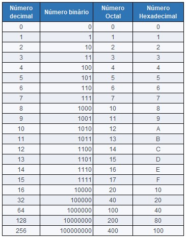
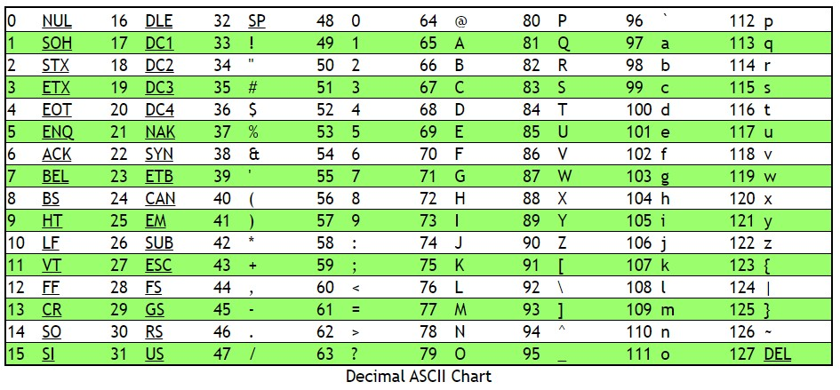

<p align="right">
   <a href="https://patyfil.github.io/cs50-cc50-harvard/">Voltar ao README</a>
</p>
<p align="right">
   <a href="https://patyfil.github.io/cs50-cc50-harvard/2-Arrays.html">Voltar ao Índice da Semana 2</a>
</p>

# [Exercício 4 - Bulbs (Lâmpadas)](https://cs50.harvard.edu/x/2023/psets/2/bulbs/)  

Lâmpadas não estão quebradas  

Na palestra, você deve ter notado o que parecia ser um “bug” na frente do palco, em que algumas das lâmpadas parecem estar sempre apagadas:

  

Cada sequência de lâmpadas, no entanto, codifica uma mensagem em binário, a linguagem que os computadores “falam”.  

Vamos escrever um programa para fazer suas próprias mensagens secretas, talvez até possamos colocá-las no palco!  

# Começando  

Abra o [VS Code](https://code.cs50.io/)

1 - Entre no *Terminal* do VsCode: `Ctrl`+`'`  

2 - Entrar nessa pasta: `cd pset2`  
OBS: Caso a pasta possua espaço, por exemplo: *Semana 2*  
Será necessário colocar aspas para entrar na pasta: `cd 'Semana 2'` 

3 - No terminal digite o comando: `wget https://cdn.cs50.net/2022/fall/psets/2/bulbs.zip`  
seguido de *ENTER* para baixar o zip [bulbs.zip](../assets/ArquivosZips/semana2/bulbs.zip) que contem a pasta *bulbs* com o arquivo em C.  

4 - Execute o unzip: `unzip bulbs.zip` para extrair a pasta *bulbs* dentro da pasta *pset2*.  

5 - Você não precisa mais do arquivo ZIP, então você pode executar o comando para excluir: `rm bulbs.zip`  

6 - Agora entre na pasta: `cd bulbs`  

7 - Se tudo foi bem sucedido, você deve executar o comando `ls` que listará os arquivos dentro dessa pasta, nesse caso deverá ter o arquivo *bulbs.c*  
A execução `code bulbs.c` deve abrir o arquivo onde você digitará seu código para este conjunto de problemas. Se não, refaça seus passos e veja se consegue determinar onde errou!  

8 - No arquivo *bulbs.c* faça o exercício proposto;

9 - Teste seu código: `check50 cs50/problems/2023/x/bulbs`;  

10 - Avalie o estilo do seu código: `style50 bulbs.c`;  

11 - Envie seu código: `submit50 cs50/problems/2023/x/bulbs` depois digite: `yes`  


# Detalhes da Implementação  

Para escrever nosso programa, primeiro precisamos pensar em **bases**.  

## O básico

A *base* mais simples é a base-1, ou *unária*; para escrever um número, *N* , na base-1, simplesmente escreveríamos *N* s consecutivos `1`. Portanto, o número `4` na base 1 seria escrito como `1111`, e o número `12` como `111111111111`. Pense nisso como contar nos dedos ou marcar uma pontuação com marcas em um quadro.  

Você pode ver porque a base-1 não é muito usada hoje em dia. (Os números ficam bastante longos!) Em vez disso, uma convenção comum é a base 10, ou *decimal*. Na base 10, cada *dígito* é multiplicado por alguma potência de 10, para representar números maiores. Por exemplo, **123** é curto para **123 = 1.10² + 2.10¹ + 3.10°**.  

Mudar de base é tão simples como mudar o **10**  
acima para um número diferente. Por exemplo, se você escreveu `123` na base 4, o número que você realmente escreveria é **123 = 1.4² + 2.4¹ + 3.4°**, que é igual ao número decimal **27**.  

Os computadores, no entanto, usam base-2 ou *binário*. Em binário, escrever `123` seria um erro, já que os números binários só podem ter `0`s e `1`s. Mas o processo de descobrir exatamente qual número decimal um número binário representa é exatamente o mesmo. Por exemplo, o número `10101` na base-2 representa **1.2⁴ + 0.2³ + 1.2² + 0.2¹ + 1.2°**, que é igual ao número decimal **21**.  

Sistema Unário B = 1 (1);  
Sistema Binário B = 2 (0 e 1);  
Sistema Decimal B = 10 (0 a 9);  
Sistema Hexadecimal B = 16 (0 a 9, A a F);  
Sistema Octal B = 8 (0 a 8)  

  


## Codificando uma mensagem
As lâmpadas só podem estar acesas ou apagadas. Em outras palavras, as lâmpadas representam dois estados possíveis; ou a lâmpada está acesa ou apagada, assim como os números binários são 1 ou 0. Teremos que encontrar uma maneira de codificar o texto como uma sequência de números binários.  

Vamos escrever um programa chamado `bulbs` que pega uma mensagem e a converte em um conjunto de lâmpadas que podemos mostrar a um público desavisado. Faremos isso em duas etapas:  

* O primeiro passo consiste em transformar o texto em números decimais. Digamos que queremos codificar a mensagem `HI!`. Felizmente, já temos uma convenção sobre como fazer isso, [ASCII](https://asciichart.com/). Observe que `H` é representado pelo número decimal `72`, `I` é representado por `73` e `!` é representado por `33`.  

  

* A próxima etapa envolve pegar nossos números decimais (como `72`, `73` e `33`) e convertê-los em números binários equivalentes, que usam apenas 0s e 1s. Para ter um número consistente de bits em cada um de nossos números binários, suponha que cada decimal seja representado com 8 bits. `72` é `01001000`, `73` é `01001001` e `33` é `00100001`.  

Por fim, interpretaremos esses números binários como instruções para as lâmpadas no palco; 0 está desligado, 1 está ligado. (Você descobrirá que `bulbs.c` inclui uma `print_bulb` função que foi implementada para você, que recebe um `0`ou `1` e emite emojis que representam lâmpadas.)  

Aqui está um exemplo de como o programa concluído pode funcionar. Ao contrário do palco Sanders (Theatre, na Universidade Harvard), imprimiremos um byte por linha para maior clareza.  

```
# ./bulbs
Message: HI!
⚫🟡⚫⚫🟡⚫⚫⚫
⚫🟡⚫⚫🟡⚫⚫🟡
⚫⚫🟡⚫⚫⚫⚫🟡
```

Para verificar nosso trabalho, podemos ler uma lâmpada acesa (🟡) como `1` e uma lâmpada apagada (⚫) como `0`. Então `HI!` se tornou

```
01001000
01001001
00100001
```

que é precisamente o que esperaríamos.

Outro exemplo:

```
# ./bulbs
Message: HI MOM
⚫🟡⚫⚫🟡⚫⚫⚫
⚫🟡⚫⚫🟡⚫⚫🟡
⚫⚫🟡⚫⚫⚫⚫⚫
⚫🟡⚫⚫🟡🟡⚫🟡
⚫🟡⚫⚫🟡🟡🟡🟡
⚫🟡⚫⚫🟡🟡⚫🟡
```

Observe que todos os caracteres estão incluídos nas instruções da lâmpada, incluindo caracteres não alfabéticos como espaços (`00100000`).  

# Especificação
Projete e implemente um programa, `bulbs`, que converta texto em instruções para a faixa de lâmpadas no palco do CS50 da seguinte forma:  

* Implemente seu programa em um arquivo chamado `bulbs.c`.  
* Seu programa deve primeiro solicitar uma mensagem ao usuário usando `get_string`.  
* Seu programa deve então converter o dado `string` em uma série de números binários de 8 bits, um para cada caractere da string.  
* Você pode usar a `print_bulb` função fornecida para imprimir uma série de `0`s e `1`s como uma série de emojis amarelos e pretos, que representam lâmpadas acesas e apagadas.  
* Cada “byte” de 8 símbolos deve ser impresso em sua própria linha quando gerado; deve haver um `\n` após o último “byte” de 8 símbolos também.  
Dicas para Decimal para Binário.  

## Dicas para Decimal para Binário
Vamos ver um exemplo com o número 4. Como você converteria 4 em binário? Comece considerando o bit mais à direita, aquele que — se ativado — adiciona 1 ao número que estamos representando. Você precisa deste bit para estar ligado? Divida 4 por 2 para descobrir:

**4/2 = 2**

2 divide igualmente em 4, o que nos diz que não há resto de 1 para se preocupar. Podemos deixar esse bit mais à direita com segurança, então:

```
0
```

E quanto ao bit anterior, agora, aquele logo à esquerda desse bit que descobrimos? Para verificar, vamos seguir um processo semelhante, mas continuar de onde paramos. No passo anterior, dividimos 4 por 2 e obtivemos 2. Agora, 2 divide igualmente em 2? Sim, então não há resto de 2 para se preocupar:

```
00
```

Vamos continuar ainda mais. Depois de dividir 2 por 2, ficamos com 1. Dividir 1 por 2 deixa um resto de 1. Isso significa que precisaremos ativar este bit:

```
100
```

E agora que dividimos nosso número até 0, não precisamos de mais bits para representá-lo. Observe que descobrimos que os bits representam 4 na ordem oposta em que precisamos imprimi-los: provavelmente precisaremos de uma estrutura que nos permita armazenar esses bits, para que possamos imprimi-los adiante mais tarde. E, claro, em seu código real, você estará trabalhando com `char`s de 8 bits, então você vai querer preceder qualquer 0 necessário.

Ao verificar os restos, o operador módulo (`%`) pode ser útil! `4 % 2`, por exemplo, retorna 0, o que significa que 2 se divide em 4 com um resto de 0.

<p align="right">
   <a href="https://patyfil.github.io/cs50-cc50-harvard/">Voltar ao README</a>
</p>
<p align="right">
   <a href="https://patyfil.github.io/cs50-cc50-harvard/2-Arrays.html">Voltar ao Índice da Semana 2</a>
</p>
