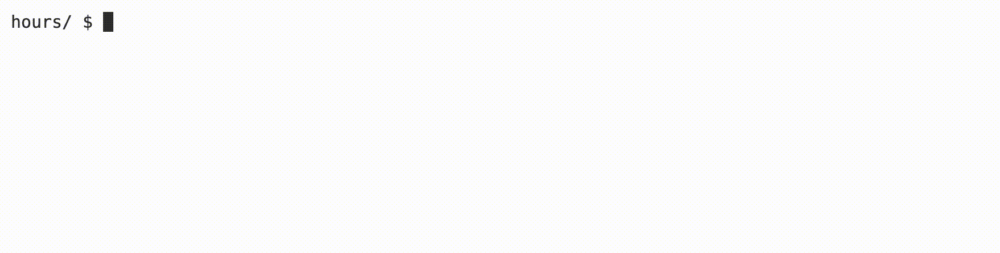

<p align="right">
   <a href="https://patyfil.github.io/cs50-cc50-harvard/">Voltar ao README</a>
</p>
<p align="right">
   <a href="https://patyfil.github.io/cs50-cc50-harvard/2-Arrays.html">Voltar ao Índice da Semana 2</a>
</p>

# [Hours](https://cs50.harvard.edu/x/2023/problems/2/hours/)  

# Metas de aprendizagem
* Pratique usando matrizes
* Usando um array como parâmetro para uma função
* Adicionando valores em um loop
* Divisão inteira e conversão de tipos

  

# Fundo
Suponha que você esteja fazendo o CS50 (se estiver lendo isso, provavelmente está!) e gastando tempo todas as semanas em cada conjunto de problemas. Você pode estar se perguntando quantas horas você gastou aprendendo ciência da computação, em média ou no total! Neste programa, você completará uma função que calcula, com base na entrada do usuário, um número total de horas ou um número médio de horas em um determinado número de dias.

## dicas
* Para somar números em uma matriz, você pode primeiro inicializar uma variável com zero. Depois, você vai querer usar um loop que adicione cada valor do array a essa variável.
* Certifique-se de prestar atenção ao que acontece se você dividir dois `ints` ao calcular a média!

# Demonstração  

  

# Começando
Faça login em [code.cs50.io](https://code.cs50.io/) usando sua conta do GitHub.  
Clique dentro da janela do terminal e execute `cd`.  
No $prompt, digite `mkdir hours`  
Agora executecd `hours`  
Em seguida, copie e cole `wget https://cdn.cs50.net/2022/fall/labs/2/hours.c` em seu terminal para baixar o código de distribuição deste laboratório.  

# Detalhes da Implementação
A função `main` solicita ao usuário o número de semanas que um usuário está tomando CS50 e, em seguida, cria uma matriz com tantos elementos. Observe que, após recuperar alguns dados, o programa solicita que o usuário digite “T” ou “A” — “T” deve (mas ainda não!) imprimir o número total de horas que o usuário inseriu, enquanto “A ” deve (mas ainda não!) imprimir as horas médias que o usuário inseriu. Observe que o `do while` loop usa `toupper` para colocar em maiúscula a letra inserida antes de ser salva na variável `output`. Em seguida, a `printf` função chama `calc_hours`. Observe a sintaxe envolvida ao passar um array para uma função.  

Para completar `calc_hours`, primeiro totalize as horas salvas na matriz em uma nova variável. Em seguida, dependendo do valor de `output`, retorne essa soma ou o número médio de horas.  

# Pergunta para reflexão  
* Qual é a vantagem de usar uma função para calcular horas?  

# Como testar seu código
Seu programa deve se comportar de acordo com os exemplos abaixo.  

```
hours/ $ ./hours
Number of weeks taking CS50: 3
Week 0 HW Hours: 3
Week 1 HW Hours: 7
Week 2 HW Hours: 10
Enter T for total hours, A for average hours per week: A
6.7 hours
```

```
hours/ $ ./hours
Number of weeks taking CS50: 2
Week 0 HW Hours: 2
Week 1 HW Hours: 8
Enter T for total hours, A for average hours per week: T
10.0 hours
```

Você pode verificar seu código usando `check50`, um programa que o CS50 usará para testar seu código quando você enviar, digitando o seguinte no `$`prompt. Mas certifique-se de testar você também!

`check50 cs50/labs/2023/x/hours`  

Para avaliar o estilo do seu código, digite o seguinte no `$`prompt.  

`style50 hours.c`

# Como enviar

Não há necessidade de enviar! Este é um problema de prática opcional concluído com seu laboratório.

<p align="right">
   <a href="https://patyfil.github.io/cs50-cc50-harvard/">Voltar ao README</a>
</p>
<p align="right">
   <a href="https://patyfil.github.io/cs50-cc50-harvard/2-Arrays.html">Voltar ao Índice da Semana 2</a>
</p>