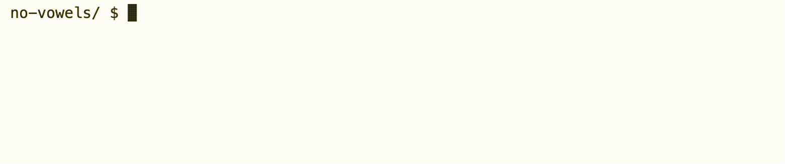

<p align="right">
   <a href="https://patyfil.github.io/cs50-cc50-harvard/">Voltar ao README</a>
</p>
<p align="right">
   <a href="https://patyfil.github.io/cs50-cc50-harvard/2-Arrays.html">Voltar ao Índice da Semana 2</a>
</p>

# [No Vow3ls (leetspeak)](https://cs50.harvard.edu/x/2023/problems/2/no-vowels/)  

# Metas de aprendizagem
* Pratique usando cordas  
* Pratique usando argumentos de linha de comando  
* Escreva um programa inteiramente do zero  

  

Fundo
Se você já esteve na internet, deve ter visto [“leetspeak”](https://en.wikipedia.org/wiki/Leet) (ou “l33tsp36k” para nossos propósitos!), que envolve a substituição de símbolos por caracteres alfabéticos, onde esses símbolos lembram um pouco suas contrapartes alfabéticas. Neste laboratório, você escreverá um programa para substituir certas vogais por dígitos!

Até agora, você frequentemente escreveu programas para os quais recebeu código de distribuição. Você notará que ao baixar a “distro” para este problema, você começa com nada mais do que algumas bibliotecas comumente usadas e uma função `main` vazia. Neste problema, você converterá uma palavra, que inserirá na linha de comando, em uma palavra correspondente com números substituindo as vogais.

# dicas
* Observe que a `main` função no código de distribuição usa `argc` e `argv`. Certifique-se de usá-los!
* Certifique-se de verificar o número correto de argumentos de linha de comando antes de fazer qualquer outra coisa em sua função `main`.

# Demonstração

  

# Começando
1 - Faça login em [code.cs50.io](https://code.cs50.io/) usando sua conta do GitHub.  
2 - Clique dentro da janela do terminal e execute `cd`.  
3 - No `$`prompt, digite `mkdir no-vowels`  
4 - Agora execute `cd no-vowels`  
5 - Em seguida, copie e cole `wget https://cdn.cs50.net/2022/fall/labs/2/no-vowels.c` em seu terminal para baixar o código de distribuição deste laboratório.  

# Detalhes da Implementação
* Implemente seu programa em um arquivo chamado `no-vowels.c` em um diretório chamado `no-vowels`.
* Seu programa deve aceitar um único argumento de linha de comando, que será a palavra que você deseja converter.
* Se seu programa for executado sem nenhum argumento de linha de comando ou com mais de um argumento de linha de comando, seu programa deve imprimir uma mensagem de erro de sua escolha (com `printf`) e `return` de `main` um valor de 1 (que tende a significar um erro) imediatamente.
* Seu programa deve conter uma função chamada `replace` que recebe uma stringentrada e retorna uma stringsaída.
* Esta função irá mudar as seguintes vogais para números: `a` torna-se `6`, etorna -se `3`, itorna -se `1`, `o` torna -se `0` e `u` não muda.
* O parâmetro de entrada para a `replace` função será `argv[1]` e o valor de retorno é a palavra convertida.
* A função principal imprimirá a palavra convertida, seguida por `\n`.
* Você pode tentar usar a [switch](https://cs50.readthedocs.io/style/c/#switches) instrução em sua `replace` função.

# Pergunta para reflexão
Por que você deseja usar argumentos de linha de comando em vez de `get_string`, `get_int`, etc?

# Como testar seu código  
Seu programa deve se comportar de acordo com os exemplos abaixo.  

```
no-vowels/ $ ./no-vowels
Usage: ./no-vowels word
```

```
no-vowels/ $ ./no-vowels hello
h3ll0
```

```
no-vowels/ $ ./no-vowels pseudocode
ps3ud0c0d3
```

Você pode verificar seu código usando `check50`, um programa que o CS50 usará para testar seu código quando você enviar, digitando o seguinte no `$`prompt. Mas certifique-se de testar você também!

`check50 cs50/labs/2023/x/no-vowels`  

Smilies verdes significam que seu programa passou no teste! Franzidas vermelhas indicarão que seu programa produz algo inesperado. Visite a URL que `check50` gera a saída para ver a entrada `check50` entregue ao seu programa, qual saída ela esperava e qual saída seu programa realmente deu.  

Para avaliar se o estilo do seu código (recuos e espaçamento) está correto, digite o seguinte no `$`prompt.  

`style50 no-vowels.c`  

# Como enviar
Não há necessidade de enviar! Este é um problema de prática opcional concluído com seu laboratório.  

<p align="right">
   <a href="https://patyfil.github.io/cs50-cc50-harvard/">Voltar ao README</a>
</p>
<p align="right">
   <a href="https://patyfil.github.io/cs50-cc50-harvard/2-Arrays.html">Voltar ao Índice da Semana 2</a>
</p>