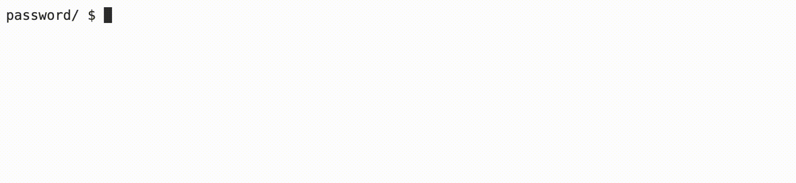

<p align="right">
   <a href="https://patyfil.github.io/cs50-cc50-harvard/">Voltar ao README</a>
</p>
<p align="right">
   <a href="https://patyfil.github.io/cs50-cc50-harvard/2-Arrays.html">Voltar ao Índice da Semana 2</a>
</p>

# [Password (Senha)](https://cs50.harvard.edu/x/2023/problems/2/password/)  

# Metas de aprendizagem

* Pratique a iteração através de uma string  
* Pratique usando a `ctype` biblioteca  
* Pratique o uso de variáveis ​​booleanas  

# Fundo  

Como todos sabemos, é importante usar senhas que não sejam fáceis de adivinhar! Muitos aplicativos da web agora exigem senhas que exigem não apenas caracteres alfabéticos, mas também números e símbolos.

Neste laboratório, o usuário é solicitado a fornecer uma senha, que será validada por meio de uma função `check` que você preencherá. Se a senha contiver pelo menos uma letra maiúscula, uma letra minúscula, um número e um símbolo (significando um caractere imprimível que não seja uma letra ou número, como '!', '$' e '#'), o função deve retornar `true`. Se não, deve retornar `false`.

## dicas
1 - A `ctype` biblioteca tem muitas funções úteis que podem ser úteis aqui.
2 - As variáveis ​​booleanas podem controlar se cada critério em um algoritmo é válido.

# Demonstração

  

# Começando
Faça login em [code.cs50.io](https://code.cs50.io/) usando sua conta do GitHub.  
Clique dentro da janela do terminal e execute `cd`.  
No $prompt, digite `mkdir password`  
Agora executecd `password`  
Em seguida, copie e cole `wget https://cdn.cs50.net/2022/fall/labs/2/password.c` em seu terminal para baixar o código de distribuição deste laboratório.
Você deve concluir a função, check, que retorna truese a senha passar em todos os critérios e `false` se não passar.

# Detalhes da Implementação
Sua função irá iterar através da senha que é fornecida a ela como um argumento. Como você precisa encontrar pelo menos uma letra minúscula, uma letra maiúscula, um número e um símbolo, convém criar uma variável booleana para cada um e definir cada um como `false`  antes de iterar na string. Se você encontrar um número, por exemplo, pode definir esse booleano como `true`. Se todos os booleanos estiverem `true`  no final da função, isso significa que todos os critérios foram atendidos e você retornaria `true`.

# Pergunta para reflexão
Quantas senhas diferentes você acha que podem ser feitas com 8 letras, podendo usar qualquer um dos 95 caracteres ASCII imprimíveis?

# Como testar seu código
Seu programa deve se comportar de acordo com os exemplos abaixo.

```
password/ $ ./password
Enter your password: hello
Your password needs at least one uppercase letter, lowercase letter, number and symbol!
```

```
password/ $ ./password
Enter your password: h3ll(
Your password needs at least one uppercase letter, lowercase letter, number and symbol!
```

```
password/ $ ./password
Enter your password: h3LL0!
Your password is valid!
```

Você pode verificar seu código usando `check50`, um programa que o CS50 usará para testar seu código quando você enviar, digitando o seguinte no prompt $. Mas certifique-se de testar você também!

`check50 cs50/labs/2023/x/password`  

Para avaliar o estilo do seu código, digite o seguinte no `$`prompt.

`style50 password.c`  

# Como enviar
Não há necessidade de enviar! Este é um problema de prática opcional concluído com seu laboratório.


<p align="right">
   <a href="https://patyfil.github.io/cs50-cc50-harvard/">Voltar ao README</a>
</p>
<p align="right">
   <a href="https://patyfil.github.io/cs50-cc50-harvard/2-Arrays.html">Voltar ao Índice da Semana 2</a>
</p>