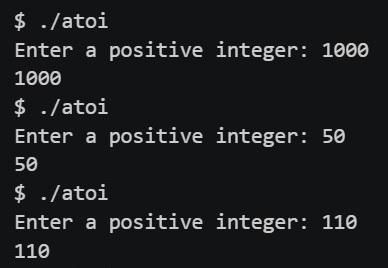
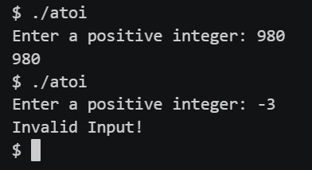

<p align="right">
   <a href="https://patyfil.github.io/cs50-cc50-harvard/">Voltar ao README</a>
</p>
<p align="right">
   <a href="https://patyfil.github.io/cs50-cc50-harvard/3-Algoritmos.html">Voltar ao Índice da Semana 3</a>
</p>

# [Recursivo atoi](https://cs50.harvard.edu/x/2023/problems/3/atoi/)  

## Metas de aprendizagem  

* Aprofunde a compreensão das cordas
* Pratique a criação de funções recursivas

# Introdução ao Exercício  

Imagine que você viaja no tempo até a década de 1970, quando a linguagem de programação `C` foi criada. Você foi contratado como programador para criar uma maneira de converter strings em ints. (Você deve se lembrar de ter usado uma função como esta na Semana 2, chamada atoi).  
Você quer ser meticuloso em seu processo de desenvolvimento e planeja tentar várias abordagens antes de decidir pela mais eficiente.  

Neste problema, você começará com uma implementação simples de atoi que lida com ints positivos usando loops. Você deseja retrabalhar isso em uma implementação que usa recursão. As funções recusivas podem consumir muita memória e nem sempre são a melhor solução, mas existem alguns problemas nos quais o uso da recursão pode fornecer uma solução mais simples e elegante.

(Role até o final desta página para ver como uma implementação de atoi pode realmente parecer.  

## dicas
* Comece obtendo o índice do último charna string (o charantes do \0).  
* Converta isso charem seu valor numérico. Você pode subtrair alguns charpara fazer isso?  
* Remova o último charda string movendo o terminador nulo uma posição para a esquerda.  
* Retorne esse valor mais 10 vezes o valor inteiro da nova string abreviada.  
* Lembre-se de que você precisa de um caso base ao criar uma função recursiva.  

# Demonstração  

  
  

# Começando  

1 - Faça login em `code.cs50.io` usando sua conta do GitHub.  

2 - Clique dentro da janela do terminal e execute `cd`.  

3 - Execute `wget https://cdn.cs50.net/2022/fall/labs/3/atoi.zip` seguido de Enter para baixar um zip chamado `atoi.zip` em seu codespace. Tome cuidado para não ignorar o espaço entre `wget` e o seguinte URL ou qualquer outro caractere!  

4 - Agora execute `unzip atoi.zip` para criar uma pasta chamada `atoi`.  

5 - Você não precisa mais do arquivo ZIP, então pode executar `rm atoi.zip` e responder com “y” seguido de Enter no prompt.  

# Detalhes da Implementação  

Na versão recursiva de `convert`, comece com o último `char` e converta-o em um valor inteiro. Em seguida, encurte a `string`, removendo o último `char` e, em seguida, chame recursivamente `convert` usando a string encurtada como entrada, onde a próxima `char` será processada.

# Pergunta para reflexão  

Por que você precisa de um caso base sempre que cria uma função recursiva?

# Como testar seu código  

Seu programa deve se comportar de acordo com os exemplos abaixo.

```
atoi/ $ ./atoi
Enter a positive integer: 3432
3432
```

```
atoi/ $ ./atoi
Enter a positive integer: 98765
98765
```

Não use `check50` para este!

Para avaliar o estilo do seu código, digite `$` no prompt.  

`style50 atoi.c`  

# Como enviar  

Não há necessidade de enviar! Este é um problema prático opcional.

# Uma implementação mais completa  

A versão real de `atoi` deve manipular números negativos, bem como espaços iniciais e caracteres não numéricos. Pode ser algo assim:  

```
#include <stdio.h>
 
// Iterative function to implement `atoi()` function in C
long atoi(const char S[])
{
    long num = 0;
    int i = 0, sign = 1;
 
    // skip white space characters
    while (S[i] == ' ' || S[i] == '\n' || S[i] == '\t') {
        i++;
    }
 
    // note sign of the number
    if (S[i] == '+' || S[i] == '-')
    {
        if (S[i] == '-') {
            sign = -1;
        }
        i++;
    }
 
    // run till the end of the string is reached, or the
    // current character is non-numeric
    while (S[i] && (S[i] >= '0' && S[i] <= '9'))
    {
        num = num * 10 + (S[i] - '0');
        i++;
    }
 
    return sign * num;
}
 
// Implement `atoi()` function in C
int main(void)
{
    char S[] = " -1234567890";
 
    printf("%ld ", atoi(S));
 
    return 0;
}
```

De [Implemente a função atoi() em C | Iterativo e Recursivo](https://www.techiedelight.com/implement-atoi-function-c-iterative-recursive/).  


<p align="right">
   <a href="https://patyfil.github.io/cs50-cc50-harvard/">Voltar ao README</a>
</p>
<p align="right">
   <a href="https://patyfil.github.io/cs50-cc50-harvard/3-Algoritmos.html">Voltar ao Índice da Semana 3</a>
</p>