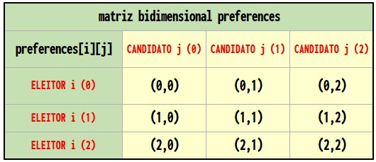
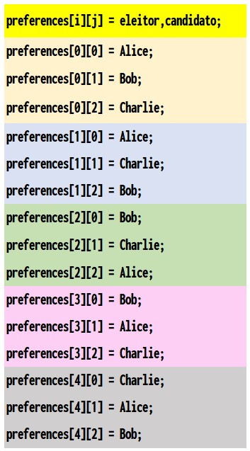
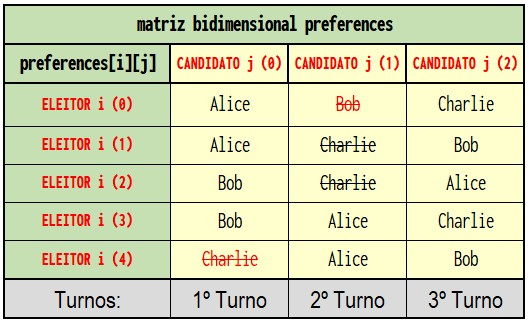
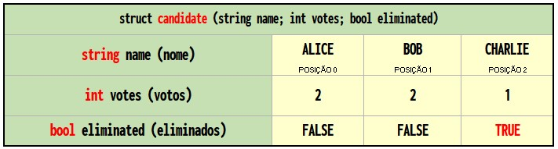

<p align="right">
   <a href="https://patyfil.github.io/cs50-cc50-harvard/">Voltar ao README</a>
</p>
<p align="right">
   <a href="https://patyfil.github.io/cs50-cc50-harvard/3-Algoritmos.html">Voltar ao Índice da Semana 3</a>
</p>

# [Exercício 2 - Runoff](https://cs50.harvard.edu/x/2023/psets/3/runoff/)  

Para este programa, você implementará um programa que executa uma eleição de segundo turno, conforme abaixo.  

```
./runoff Alice Bob Charlie
Number of voters: 5     // Número de eleitores
Rank 1: Alice
Rank 2: Bob
Rank 3: Charlie

Rank 1: Alice
Rank 2: Charlie
Rank 3: Bob

Rank 1: Bob
Rank 2: Charlie
Rank 3: Alice

Rank 1: Bob
Rank 2: Alice
Rank 3: Charlie

Rank 1: Charlie
Rank 2: Alice
Rank 3: Bob

Alice
```

  

# Introdução ao Exercício  

Você já conhece as eleições pluralistas, que seguem um algoritmo muito simples para determinar o vencedor de uma eleição: cada eleitor recebe um voto, e o candidato com mais votos vence.  

Mas o voto de pluralidade tem algumas desvantagens. O que acontece, por exemplo, em uma eleição com três candidatos, e as cédulas abaixo são lançadas?  
 


Uma votação de pluralidade aqui declararia um empate entre Alice e Bob, já que cada um tem dois votos. Mas esse é o resultado certo?

Há outro tipo de sistema de votação, conhecido como sistema de votação por classificação (escolha ranqueada). Em um sistema de escolha ranqueada, os eleitores podem votar em mais de um candidato. Em vez de apenas votar na primeira escolha, eles podem classificar os candidatos em ordem de preferência. As cédulas resultantes podem, portanto, parecer como abaixo.


Aqui, cada eleitor, além de especificar seu candidato de primeira preferência, também indicou sua segunda e terceira opções. E agora, o que antes era uma eleição empatada agora pode ter um vencedor. A corrida estava originalmente empatada entre Alice e Bob, então Charlie estava fora da corrida. Mas o eleitor que escolheu Charlie preferiu Alice a Bob, então Alice poderia ser declarada a vencedora.

A votação por escolha classificada também pode resolver outra desvantagem potencial da votação por pluralidade. Confira as votações a seguir.


Quem deve ganhar esta eleição? Em uma votação de pluralidade em que cada eleitor escolhe apenas sua primeira preferência, Charlie vence esta eleição com quatro votos em comparação com apenas três para Bob e dois para Alice. Mas a maioria dos eleitores (5 de 9) ficaria mais feliz com Alice ou Bob em vez de Charlie. Ao considerar as preferências classificadas, um sistema de votação pode escolher um vencedor que reflita melhor as preferências dos eleitores.

Um desses sistemas de votação por escolha classificada é o sistema de runoff instantâneo (ou uma eleição com turnos). Em uma eleição de segundo turno instantânea, os eleitores podem classificar quantos candidatos desejarem. ***Se algum candidato obtiver a maioria (mais de 50%) dos primeiros votos preferenciais, esse candidato é declarado vencedor da eleição***.

Se nenhum candidato tiver mais de 50% dos votos, ocorre um “segundo turno instantâneo”. O candidato que recebeu o menor número de votos é eliminado da eleição, e quem originalmente escolheu esse candidato como sua primeira preferência agora tem sua segunda preferência considerada. Por que fazer desta forma? Efetivamente, isso simula o que teria acontecido se o candidato menos popular não estivesse na eleição para começar.

O processo se repete: se nenhum candidato tiver a maioria dos votos, o último colocado é eliminado e quem votou nele votará em sua próxima preferência (os que ainda não foram eliminados). Uma vez que um candidato tenha a maioria, esse candidato é declarado vencedor.

Vamos considerar as nove cédulas acima e examinar como ocorreria um segundo turno.

Alice tem dois votos, Bob tem três votos e Charlie tem quatro votos. Para vencer uma eleição com nove pessoas, é necessária a maioria (cinco votos). Como ninguém tem a maioria, um segundo turno precisa ser realizado. Alice tem o menor número de votos (com apenas dois), então Alice é eliminada. Os eleitores que originalmente votaram em Alice listaram Bob como segunda preferência, então Bob recebe os dois votos extras. Bob agora tem cinco votos e Charlie ainda tem quatro votos. Bob agora tem a maioria e Bob é declarado o vencedor.

Que casos extremos precisamos considerar aqui?

Uma possibilidade é que haja um empate para quem deve ser eliminado. Podemos lidar com esse cenário dizendo que todos os candidatos empatados em último lugar serão eliminados. No entanto, se todos os candidatos restantes tiverem exatamente o mesmo número de votos, eliminar os candidatos empatados em último lugar significa eliminar todos! Então, nesse caso, teremos que tomar cuidado para não eliminar todos, e apenas declarar a eleição um empate entre todos os candidatos restantes.

Algumas eleições de segundo turno instantâneas não exigem que os eleitores classifiquem todas as suas preferências - portanto, pode haver cinco candidatos em uma eleição, mas um eleitor pode escolher apenas dois. No entanto, para os propósitos deste problema, vamos ignorar esse caso particular e assumir que todos os eleitores classificarão todos os candidatos em sua ordem de preferência.

Parece um pouco mais complicado do que um voto de pluralidade, não é? Mas sem dúvida tem o benefício de ser um sistema eleitoral em que o vencedor da eleição representa com mais precisão as preferências dos eleitores.

# Começando  

Abra o [VS Code](https://code.cs50.io/)

1 - Entre no *Terminal* do VsCode: `Ctrl`+`'`  

2 - Entrar nessa pasta: `cd pset3`  
OBS: Caso a pasta possua espaço, por exemplo: *Semana 3*  
Será necessário colocar aspas para entrar na pasta: `cd 'Semana 3'` 

3 - No terminal digite o comando: `wget https://cdn.cs50.net/2022/fall/psets/3/runoff.zip`  
seguido de *ENTER* para baixar o arquivo zipado [runoff.zip](https://patyfil.github.io/cs50-cc50-harvard/semana3/runoff.zip) que contem a pasta *runoff* com seus arquivos.  

4 - Execute o unzip: `unzip runoff.zip` para extrair a pasta *runoff* dentro da pasta *pset3*.  

5 - Você não precisa mais do arquivo ZIP, então você pode executar o comando para excluir: `rm runoff.zip`  

6 - Agora entre na pasta: `cd runoff`  

7 - Se tudo foi bem sucedido, você deve executar o comando `ls` que listará os arquivos dentro dessa pasta, nesse caso deverá ter o arquivo *runoff.c*  
A execução `code runoff.c` deve abrir o arquivo onde você digitará seu código para este conjunto de problemas. Se não, refaça seus passos e veja se consegue determinar onde errou!  

8 - Leia as instruções logo abaixo;

9 - Teste seu código: `check50 cs50/problems/2023/x/runoff`;  

10 - Avalie o estilo do seu código: `style50 runoff.c`;  

11 - Envie seu código: `submit50 cs50/problems/2023/x/runoff` depois digite: `yes`  

&nbsp;

[Ver o progresso no Curso](https://cs50.me/cs50x)

&nbsp;

# Compreensão

Vamos dar uma olhada no que já está no arquivo `runoff.c`. Estamos definindo duas constantes: `MAX_CANDIDATES` para o número máximo de candidatos na eleição e `MAX_VOTERS` para o número máximo de eleitores na eleição.

```
// Máximo de eleitores e candidatos
#define MAX_VOTERS 100
#define MAX_CANDIDATES 9
```

Em seguida, estão as preferências de uma matriz bidimensional `preferences`. O vetor `preferences[i]` representará todas as preferências para o eleitor número `i` e o vetor `preferences[j]` armazenara o índice do candidato `j` que é preferência do eleitor `i`.

```
// "preferences[i][j]" é a jª preferência do eleitor i
int preferences[MAX_VOTERS][MAX_CANDIDATES];
```
  

  

1ª Turno = Charlie é *ELIMINADO*, Alice e Bob *EMPATAM*.  

2ª Turno = Bob é *ELIMINADO* e como Charlie já tinha sido eliminado no 1º Turno, então Alice *VENCE*.  

A próxima parte do código é um `struct` chamado `candidate`. Cada `candidate` tem um campo de `string` para seu `name` e `int` representa o número de `votes` que possui atualmente, e um valor `bool` chamado `eliminated` que indica se o candidato foi eliminado da eleição. A matriz `candidates` manterá o controle de todos os candidatos na eleição.  

```
// Os candidatos têm nome, contagem de votos e status eliminado
typedef struct {
  string name;
  int votes;
  bool eliminated;
} candidate;
```

  

O programa também possui duas variáveis ​​globais: `voter_count` e `candidate_count`.  

```
// Número de eleitores e candidatos
int voter_count;
int candidate_count;
```

Agora em `main`. Observe que depois de determinar o número de candidatos e o número de eleitores, o loop principal de votação começa, dando a cada eleitor a chance de votar.  

À medida que o eleitor insere suas preferências, a função `vote` é chamada para acompanhar todas as preferências. Se, a qualquer momento, a cédula for considerada inválida, o programa será encerrado.  

```
    // LOOP PRINCIPAL 
    // Para cada eleitor i até alcançar o número total de eleitor
    for (int i = 0; i < voter_count; i++)
    {

        // Para cada candidato j até alcançar o número total de candidatos
        for (int j = 0; j < candidate_count; j++)
        {
            string name = get_string("Rank %i: ", j + 1);

            // Se não for um voto válido, encerre o programa
            if (!vote(i, j, name))
            {
                printf("Invalid vote.\n");
                return 4;
            }
        }

        printf("\n");
    }
```

&nbsp;


Uma vez que todos os votos foram alcançados, outro loop começa: este vai continuar repetindo o processo de verificação de um vencedor e eliminando o candidato do último lugar até que haja um vencedor.  

```
    // Continue solicitando votos até que o vencedor exista
    while (true)
    {
        // Calcular os votos dados aos candidatos restantes
        tabulate();

        // Verifique se a eleição foi vencida
        bool won = print_winner();
        if (won)
        {
            break;
        }

        // Elimine os últimos candidatos
        int min = find_min();
        bool tie = is_tie(min);

        // Se empatar, todos ganham
        if (tie)
        {
            for (int i = 0; i < candidate_count; i++)
            {
                if (!candidates[i].eliminated)
                {
                    printf("%s\n", candidates[i].name);
                }
            }
            break;
        }

        // Elimine qualquer um com menor número de votos
        eliminate(min);

        // Redefinir contagem de votos de volta a zero
        for (int i = 0; i < candidate_count; i++)
        {
            candidates[i].votes = 0;
        }
    }
    return 0;
```

&nbsp;

```
// Protótipos de funções
bool vote(int voter, int rank, string name);
void tabulate(void); // Calcula os totais de votos atuais
bool print_winner(void);
int find_min(void); // menor número de votos que alguém na eleição recebeu
bool is_tie(int min);   // Todos que empataram
void eliminate(int min);    // Último lugar eliminado
```

&nbsp;

A primeira chamada aqui é para uma função chamada `tabulate`, que deve examinar todas as preferências dos eleitores e calcular os totais de votos atuais, observando o candidato mais escolhido de cada eleitor que ainda não foi eliminado.  

```
// Tabelar votos para candidatos não eliminados
void tabulate(void)
{
    // TODO
    return;
}
```

&nbsp;

Em seguida, a função `print_winner` deve imprimir o vencedor, caso aplicavel; se houver, o programa acabou.  

```
// Imprima o vencedor da eleição, se houver
bool print_winner(void)
{
    // TODO
    return false;
}
```

&nbsp;

Caso contrário, o programa precisa determinar o menor número de votos que alguém na eleição recebeu (por meio de uma chamada para `find_min`).  

```
// Retorne o menor número de votos que qualquer candidato restante possui
int find_min(void)
{
    // TODO
    return 0;
}
```

&nbsp;

Se todos na eleição estiverem empatados com o mesmo número de votos (conforme determinado pela função `is_tie`), a eleição é declarada empatada; 

```
// Retorna verdadeiro se a eleição estiver empatada entre todos os candidatos, falso caso contrário.
bool is_tie(int min)
{
    // TODO
    return false;
}
```

&nbsp;

caso contrário, o candidato (ou candidatos) em último lugar é eliminado da eleição por meio de uma chamada para a função `eliminate`.  

```
// Eliminar o candidato (ou candidatos) em último lugar
void eliminate(int min)
{
    // TODO
    return;
}
```

&nbsp;

Se você olhar um pouco mais abaixo no arquivo, verá que essas funções — `vote`, `tabulate`, `print_winner`, `find_min`, `is_tie` e `eliminate` — são todas deixadas para você concluir!  

&nbsp;

# Especificação

Conclua a implementação de `runoff.c` de forma que simule uma eleição de turnos. Você deve concluir as implementações das funções `vote`, `tabulate`, `print_winner`, `find_min`, `is_tie` e `eliminate` e não deve modificar mais nada em `runoff.c`(além da inclusão de arquivos de cabeçalho adicionais, se desejar).  

## `vote`

```
// Registre a preferência se o voto for válido

bool vote(int voter, int rank, string name)
{
    // TODO
    return false;
}
```

Conclua a função `vote`.

* A função recebe os argumentos `voter`, `rank` e `name`. Se `name` for uma correspondência para o nome de um candidato válido, você deve atualizar a matriz de preferências globais para indicar que o eleitor `voter` tem esse candidato como sua preferência de `rank` (onde `0` é a primeira preferência, `1` é a segunda preferência, etc.).  
* Se a preferência for registrada com sucesso, a função deve retornar `true`; caso contrário a função deve retornar `false` (se, por exemplo, `name` não for o nome de um dos candidatos).
* Você pode considerar que não haverá dois candidatos com o mesmo nome.

### Dicas

* Lembre-se que `candidate_count` armazena o número de candidatos na eleição.
* Lembre-se de que você pode usar [strcmp](https://man.cs50.io/3/strcmp) para comparar duas strings.
* Lembre-se que `preferences[i][j]` armazena o índice do candidato que é a `j` ésima preferência classificada para o `i` ésimo eleitor.  

## `tabulate`

```
// Tabelar votos para candidatos não eliminados
void tabulate(void)
{
    // TODO
    return;
}
```

Conclua a função `tabulate`.

* A função deve atualizar o número de `votes` que cada candidato possui nesta etapa do segundo turno.
* Lembre-se de que, em cada etapa do segundo turno, todo eleitor vota efetivamente em seu candidato preferido que ainda não foi eliminado.

### Dicas

* Lembre-se que `voter_count` armazena o número de eleitores na eleição e que, para cada eleitor em nossa eleição, queremos contar uma cédula.
* Lembre-se de que, para um eleitor `i`, seu candidato de primeira escolha é representado por `preferences[i][0]`, seu candidato de segunda escolha por `preferences[i][1]`, etc.
* Lembre-se que o `struct` do `candidate`  tem um campo chamado `eliminated`, que será `true` caso o candidato tenha sido eliminado da eleição.
* Lembre-se de que o `struct` do`candidate` tem um campo chamado `votes`, que você provavelmente desejará atualizar para o candidato preferido de cada eleitor.
* Depois de votar no primeiro candidato não eliminado de um eleitor, você deve parar por aí, não continuar na cédula! Lembre-se de que você pode sair de um loop antecipadamente usando `break` dentro de uma condicional.

## `print_winner`

```
// Imprima o vencedor da eleição, se houver
bool print_winner(void)
{
    // TODO
    return false;
}
```

Conclua a função `print_winner`.

* Caso algum candidato tenha mais da metade dos votos, seu nome deverá ser impresso em `stdout` e a função deverá retornar `true`.
* Se ninguém ganhou a eleição ainda, a função deve retornar `false`.

### Dicas

* Lembre-se que `voter_count` armazena o número de eleitores na eleição. Diante disso, como você expressaria o número de votos necessários para vencer a eleição?

## `find_min`

```
// Retorne o menor número de votos que qualquer candidato restante possui
int find_min(void)
{
    // TODO
    return 0;
}
```

Conclua a função `find_min`.

* A função deve retornar o total mínimo de votos para qualquer candidato que ainda esteja na eleição.

### Dicas

* Você provavelmente desejará percorrer os candidatos para encontrar aquele que ainda está na eleição e tem o menor número de votos. Quais informações você deve acompanhar enquanto percorre os candidatos?

## `is_tie`

```
// Retorna verdadeiro se a eleição estiver empatada entre todos os candidatos, falso caso contrário.
bool is_tie(int min)
{
    // TODO
    return false;
}
```

Conclua a função `is_tie`.

* A função recebe um argumento `min`, que será o número mínimo de votos que qualquer pessoa na eleição possui atualmente.
* A função deve retornar `true` se todos os candidatos restantes na eleição tiverem o mesmo número de votos e deve retornar `false` caso contrário.

### Dicas

* Lembre-se que o empate acontece se todos os candidatos ainda na eleição tiverem o mesmo número de votos. Observe também que a função `is_tie` aceita um argumento `min`, que é o menor número de votos que qualquer candidato possui atualmente. Como você pode usar essa informação para determinar se a eleição é um empate (ou, inversamente, não é um empate)?

## `eliminate`

```
// Eliminar o candidato (ou candidatos) em último lugar
void eliminate(int min)
{
    // TODO
    return;
}
```

Conclua a função `eliminate`.

* A função recebe um argumento `min`, que será o número mínimo de votos que qualquer pessoa na eleição possui atualmente.
* A função deve eliminar o candidato (ou candidatos) que tiverem `min` número de votos.

# PASSO A PASSO  

Este vídeo irá te ajudar a entender o problema ;)  
Atenção: para adicionar legendas ao vídeo clique no botão CC localizado no Player e selecione a opção "Português (Brasil)".  
Uma excelente aula para você!  
##  [CC50: PSet 3 - Runoff](https://youtu.be/V2LVq_yNPss)

&nbsp;

# Uso
Seu programa deve se comportar conforme o exemplo abaixo:  

```
./runoff Alice Bob Charlie
Number of voters: 5
Rank 1: Alice
Rank 2: Charlie
Rank 3: Bob

Rank 1: Alice
Rank 2: Charlie
Rank 3: Bob

Rank 1: Bob
Rank 2: Charlie
Rank 3: Alice

Rank 1: Bob
Rank 2: Charlie
Rank 3: Alice

Rank 1: Charlie
Rank 2: Alice
Rank 3: Bob

Alice
```

# Como testar o seu código?

Certifique-se de testar seu código para ter certeza de que ele lida com…

* Uma eleição com qualquer número de candidatos (até o `MAX` de `9`);  
* Votar em um candidato pelo nome;  
* Votos inválidos para candidatos que não constam na cédula;  
* Imprimindo o vencedor da eleição se houver apenas um;  
* Não eliminar ninguém em caso de empate entre todos os candidatos restantes.  

<p align="right">
   <a href="https://patyfil.github.io/cs50-cc50-harvard/">Voltar ao README</a>
</p>
<p align="right">
   <a href="https://patyfil.github.io/cs50-cc50-harvard/3-Algoritmos.html">Voltar ao Índice da Semana 3</a>
</p>
